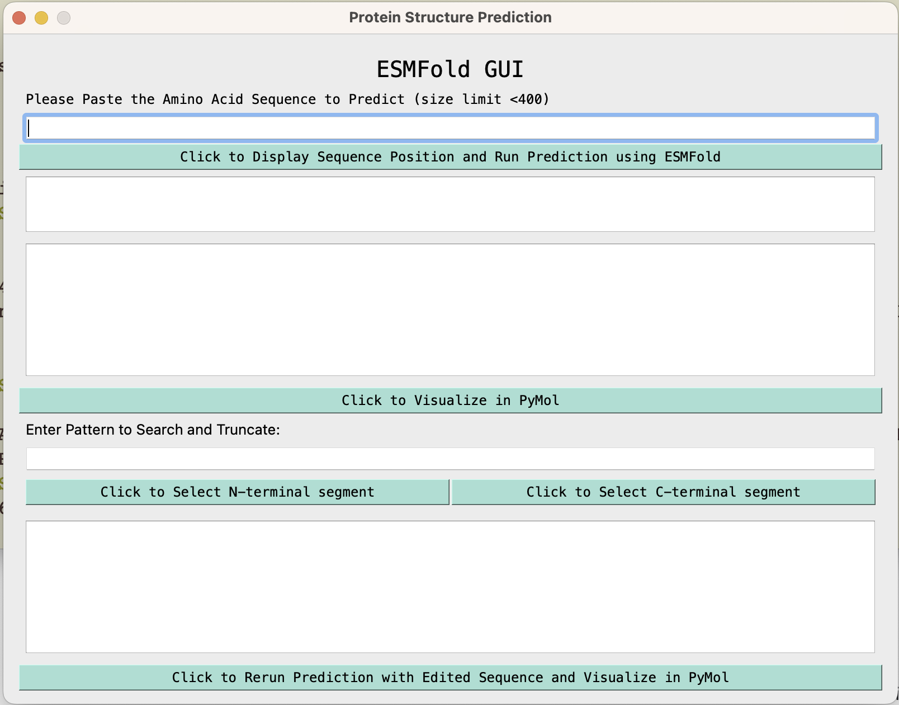
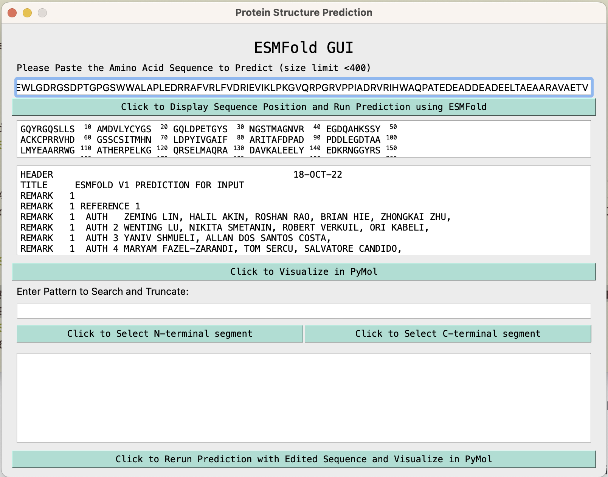
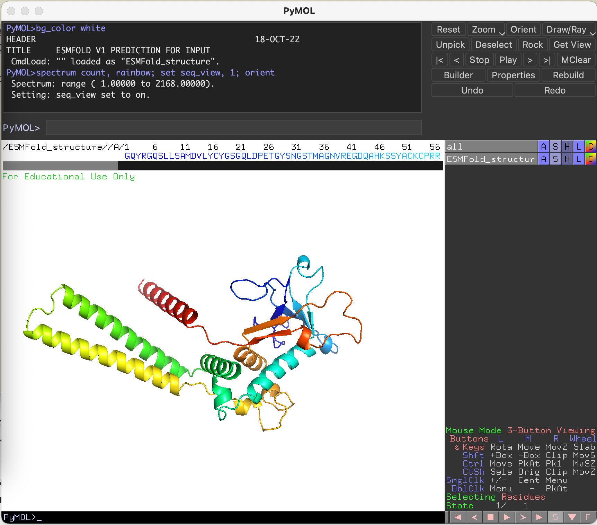
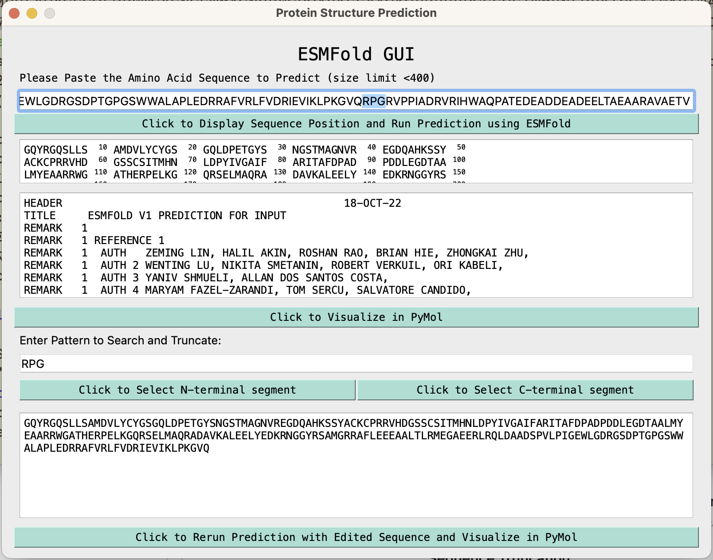
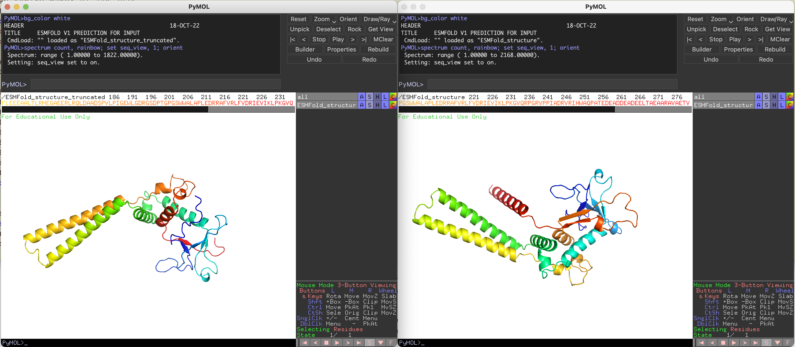

# ESMFold_gui.py for a quick structure prediction
<!-- What is this for? -->
Graphical User Interface for ESMFold

The Graphical User Interface (GUI) for ESMFold is designed to provide users with a convenient way to visualize protein structures based on an amino acid sequence of interest (<400 amino acid residues). 

Here is a snippet of how you can run the script...
```
./ESMFold_gui.py
```

<p float="left">
  
  
</p>

Here's an overview of its features:

**Sequence Input**:   
The user can copy and paste the amino acid sequence into a designated input field.

**Prediction Button**:   
Once the sequence is pasted, the user can click on the "Predict" button to initiate the structure prediction process. 
After the prediction is complete, the GUI will automatically generate the predicted protein structure and the corresponding FASTA sequence. 



**Structure Visualization**:   
If the user has Pymol installed on their system, the GUI provides an additional button for visualizing the predicted protein structure. 
By clicking on the "Visualize" button, the user can view the structure in Pymol.



**Sequence Truncation**:   
The GUI also offers a convenient way to truncate sequences. If the user wants to visualize only a specific portion of the protein, they can input the desired starting and ending positions. The GUI will truncate the sequence accordingly and update the predicted structure and FASTA sequence in real-time.



<details>
   <summary> :rocket: Click here for the python script </summary>
   
   ```Python
#!/usr/bin/env python3
# -*- coding: utf-8 -*-
from PyQt5.QtWidgets import QApplication, QWidget, QVBoxLayout, QHBoxLayout, QLabel, QLineEdit, QPushButton, QTextEdit, QSizePolicy
from PyQt5.QtGui import QFont
from PyQt5.QtCore import Qt
import requests
import subprocess
import os
import re
from Bio import SeqIO

#create the main application window
app = QApplication([])
window = QWidget()
window.setWindowTitle("Protein Structure Prediction")
window.setFixedSize(800, 600)

#define the GUI layout
layout = QVBoxLayout()
window.setLayout(layout)

#create labels, input fields, and buttons
title_label=QLabel("ESMFold GUI")
title_label.setAlignment(Qt.AlignCenter)
sequence_label = QLabel("Please Paste the Amino Acid Sequence to Predict (size limit <400)")
sequence_input = QLineEdit()
run_button = QPushButton("Click to Display Sequence Position and Run Prediction using ESMFold")
sequence_display = QTextEdit()
edited_sequence_display = QTextEdit()
open_button = QPushButton("Click to Visualize in PyMol")
structure_display = QTextEdit()
pattern_label = QLabel("Enter Pattern to Search and Truncate:")
pattern_input = QLineEdit()
nt_button = QPushButton("Click to Select N-terminal segment")
ct_button = QPushButton("Click to Select C-terminal segment")
rerun_button=QPushButton("Click to Rerun Prediction with Edited Sequence and Visualize in PyMol")

sequence_display.setSizePolicy(QSizePolicy.Minimum, QSizePolicy.Fixed)

# Adjust the height of sequence_display
sequence_display.setFixedHeight(50)  # Set the desired height

# Adjust the size policy of structure_display to allow it to expand
structure_display.setSizePolicy(QSizePolicy.Expanding, QSizePolicy.Expanding)

run_button.setStyleSheet("background-color: #b1ddd3; color: black;")
nt_button.setStyleSheet("background-color: #b1ddd3; color: black;")
ct_button.setStyleSheet("background-color: #b1ddd3; color: black;")
open_button.setStyleSheet("background-color: #b1ddd3; color: black;")
rerun_button.setStyleSheet("background-color: #b1ddd3; color: black;")

#set font properties
font = QFont("Courier")
f_t  = QFont("Courier")
f_t.setPointSize(20)
font.setPointSize(12)
title_label.setFont(f_t)
sequence_label.setFont(font)
edited_sequence_display.setFont(font)
structure_display.setFont(font)
run_button.setFont(font)
nt_button.setFont(font)
ct_button.setFont(font)
open_button.setFont(font)
sequence_display.setFont(font)
rerun_button.setFont(font)

#set properties for sequence display fields
sequence_display.setReadOnly(True)
sequence_display.setLineWrapMode(QTextEdit.WidgetWidth)  # Enable line wrapping
sequence_display.setFont(font)
edited_sequence_display.setReadOnly(True)
edited_sequence_display.setLineWrapMode(QTextEdit.WidgetWidth)  # Enable line wrapping
edited_sequence_display.setFont(font)

#add elements to the layout
layout.addWidget(title_label)
layout.addWidget(sequence_label)
layout.addWidget(sequence_input)
layout.addWidget(run_button)
layout.addWidget(open_button)
layout.addWidget(sequence_display)
layout.addWidget(structure_display)
layout.addWidget(open_button)
layout.addWidget(pattern_label)
layout.addWidget(pattern_input)

buttons_layout=QHBoxLayout()
layout.addLayout(buttons_layout)
buttons_layout.addWidget(nt_button)
buttons_layout.addWidget(ct_button)
layout.addWidget(edited_sequence_display)
layout.addWidget(rerun_button)

#define the function to run the protein structure prediction
def run_prediction():
    sequence = sequence_input.text()
    if not sequence:
        return
    with open("ESMFold_structure.fasta", "w") as f:
        f.write(f">ESMFold_structure\n{sequence}")

    url = "https://api.esmatlas.com/foldSequence/v1/pdb/"
    headers = {"Content-Type": "text/plain"}
    data = sequence

    response = requests.post(url, headers=headers, data=data)

    if response.status_code == 200:
        with open("ESMFold_structure.pdb", "w") as f:
            f.write(response.text)
            sequence_display.setText(add_position_labels(sequence))
            structure_display.setText(response.text)
    else:
        structure_display.setText(f"Error: {response.status_code}")
        sequence_display.setText(f"Error: {response.status_code}")

def add_position_labels(sequence):
    positions = list(range(10, len(sequence) + 1, 10))
    labeled_sequence = ""
    for i, char in enumerate(sequence):
        labeled_sequence += char
        if (i + 1) % 10 == 0:
            labeled_sequence += " <sup>{:3d}</sup> ".format(i + 1)
        if (i + 1) % 50 == 0:
            labeled_sequence += "\n"
    return f"<pre>{labeled_sequence}</pre>"

def truncate_sequence_nt():
    pattern = pattern_input.text()
    fasta_file = "ESMFold_structure.fasta"

    if not pattern:
        return

    for record in SeqIO.parse(fasta_file, "fasta"):
        # Search for a pattern using a regular expression
        match = re.search(pattern, str(record.seq))
        if match:
            # Get the start and end positions of the match
            start_pos = match.start() + 1  # Add 1 to convert from 0-based to 1-based numbering
            truncated_seq = str(record.seq)[:start_pos-1]
            edited_sequence_display.setText(truncated_seq)
            with open("ESMFold_structure_truncated.fasta","w") as f:
                f.write(f">ESMFold_structure_truncated\n{truncated_seq}")
            break
        else:
            print("Pattern not found.")


def truncate_sequence_ct():
    pattern = pattern_input.text()
    fasta_file = "ESMFold_structure.fasta"

    if not pattern:
        return

    for record in SeqIO.parse(fasta_file, "fasta"):
        # Search for a pattern using a regular expression
        match = re.search(pattern, str(record.seq))
        if match:
            # Get the start and end positions of the match
            start_pos = match.start() + 1  # Add 1 to convert from 0-based to 1-based numbering
            truncated_seq = str(record.seq)[start_pos-1:]
            edited_sequence_display.setText(truncated_seq)
            with open("ESMFold_structure_truncated.fasta","w") as f:
                f.write(f">ESMFold_structure_truncated\n{truncated_seq}")
            break
        else:
            print("Pattern not found.")

def open_structure():
    file_path = os.path.abspath("ESMFold_structure.pdb")
    subprocess.Popen(["pymol", "-d", 'bg_color white' , file_path, "-d", 'spectrum count, rainbow; set seq_view, 1; orient'])

def rerun_prediction():
    sequence = edited_sequence_display.toPlainText()
    with open("ESMFold_structure_truncated.fasta", "w") as f:
        f.write(f">ESMFold_structure_truncated\n{sequence}")

    url = "https://api.esmatlas.com/foldSequence/v1/pdb/"
    headers = {"Content-Type": "text/plain"}
    data = sequence

    response = requests.post(url, headers=headers, data=data)

    if response.status_code == 200:
        with open("ESMFold_structure_truncated.pdb", "w") as f:
            f.write(response.text)
            sequence_display.setText(add_position_labels(sequence))
            structure_display.setText(response.text)
    else:
        structure_display.setText(f"Error: {response.status_code}")
        sequence_display.setText(f"Error: {response.status_code}")
def open_structure_truncated():
    file_path = os.path.abspath("ESMFold_structure_truncated.pdb")
    subprocess.Popen(["pymol", "-d", 'bg_color white' , file_path, "-d", 'spectrum count, rainbow; set seq_view, 1; orient'])

#connect the buttons to their respective functions
run_button.clicked.connect(run_prediction)
nt_button.clicked.connect(truncate_sequence_nt)
ct_button.clicked.connect(truncate_sequence_ct)
open_button.clicked.connect(open_structure)
rerun_button.clicked.connect(rerun_prediction)
rerun_button.clicked.connect(open_structure_truncated)

window.show()
app.exec_()

   ```
</details>
