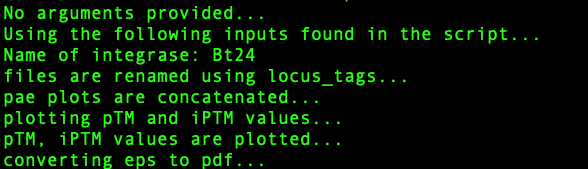

# Introduction to [`VirtualPullDown`](https://github.com/heeropang/VirtualPullDown/tree/main) package (unpublished)
<!-- What is this for? -->
**ColabFold** is a web-based, open-source platform that leverages deep learning models for protein folding and related tasks. It utilizes the power of artificial intelligence to predict protein structures, including multimeric complexes, with remarkable accuracy from their amino acid sequences. 

A **Pull-down** experiment is a *in-vitro* technique used to study protein-protein interactions, where a `bait` protein is immobilized on a solid support and `prey` proteins are screened for interaction with the bait protein. 

The `VirtualPulldown` approach combines the concept of pull-down experiments with computational protein structure prediction to provide economical and efficient ways to rapidly screen and study novel protein complexes. While this approach has great potential to accelerate progress in drug discovery and related fields, it is not without its potential disadvantages. As the accuracy of ColabFold's predictions is a crucial aspect of this approach, researchers must exercise careful evaluation and validation before the findings can be considered true protein complex structures. Nonetheless, the VirtualPulldown approach can provide additional information when utilized alongside conventional methods in bioinformatics and structure studies.. :thumbsup:

## Getting started with *VirtualPullDown*
This package streamlines the virtual pulldown experiment through ColabFold by utilizing three steps:
1.  Pre-processing: efficiently preparing input files (paired sequences) in batch for ColabFold
2.  Prediction: utilizing local ColabFold to predict models of monomer/multimer
3.  Post-processing: generating figures to facilitate navigation and interpretation of virtual pulldown results.
------------------
Why it might be a good choice?
<!-- Why it might be a good choice? -->
* This package offers a :star: one-step pre-processing solution for users to efficiently prepare any number of sequence files for virtual pulldown in seconds. 
* We utilize local ColabFold for batch protein structure prediction, eliminating concerns of time-out and GPU limitations. 
* Using ColabFold also requires less database storage compared to native AlphaFold2.
* The package offers a :star: one-step post-processing feature that generates figures to help users quickly navigate the results. 
* The overall process requires far less time compared to manual processing of scanning any number of genes, and is exponentially more efficient when handling large number of genes.
* Individual scripts can provide users flexibility to explore their ideas such as expanding proteoms to more than one organism or having multiple sequence of interests or known complex as baits.   

## Step 1. Preprocessing
In this step, the sequence files are processed to be used as input files for ColabFold. The script utilizes the genomic protein sequence (i.e., sequence.txt) downloaded from NCBI and the protein sequence of interest (i.e., integrase.fasta).

The template_auto.py script first searches for prophages using Phaster.ca and fetches those regions (if found) upon user consent. Otherwise, the script prompts the user to specify the region of interest in the genomic sequence.

Next, the script individually pairs the fetched protein sequences within the specified region (as prey sequences) with the sequence of interest (as a bait sequence).

## Dependencies

This package needs --['BIO'](https://biopython.org),--['openpyxl'](https://foss.heptapod.net/openpyxl/openpyxl), and --['run'](https://github.com/heeropang/VirtualPullDown/tree/main/preprocessing/run).  

### :star: One step preprocessing with `template_auto.py`
`template_auto.py` combines searching prophage region, organizing proteoms, fetching protein sequences, preparing paired input files for ColabFold

Here are the two ways you can run the script...


<details>
   <summary> :rocket: Click here for the python script </summary>
   
   ```Python
   #!/usr/bin/env python
   """
   Usage:        ./template_auto.py
   Author:       Heewhan Shin
   Author_email: hshin40@gmail.com
   Date:         April 25, 2023
   Description:  This script identifies prophages (if any) then produces paired input sequence files for multimer predictions using localcolabfold.
   """ 
   from run import create_mastertable, identify_prophage_region, filter_prey_sequences, combine_pairwise_batch
   import subprocess
   import glob
   import os
   import sys
   import argparse
 
   ## Specify inputs
   ###########################################################
   path            = "./"                  #Working directory
   filename        = 'sequence'            #Genomic sequence
   prey_size_limit = 400                   #Residue size
   bait_name       = 'Bt24'                #Name of integrase
   accession_number= 'NZ_NVLR01000020.1'
   ###########################################################

   parser = argparse.ArgumentParser(description='Identify prophages and prepare input sequence files for multimer predictions using localcolabfold')
   parser.add_argument('bait_name_given', metavar='bait_name_given', type=str, nargs='?', default=None, help='Name of integrase')
   parser.add_argument('accession_number_given', metavar='accession_number_given', type=str, nargs='?', default=None, help='Accession number of the genomic sequence')
   args = parser.parse_args()

   if args.bait_name_given and args.accession_number_given:
       bait_name = args.bait_name_given
       accession_number = args.accession_number_given
       print(f"Name of integrase: {args.bait_name_given}")
       print(f"Accession number of the genomic sequence: {args.accession_number_given}")
   else:
       bait_name = bait_name
       accession_number = accession_number
       print("No arguments provided...")
       print("Using the following inputs found in the script...")
       print(f"Name of integrase: {bait_name}")
       print(f"Accession number of the genomic sequence: {accession_number}")
 
   ## Checking prerequisite files
   if not os.path.isfile("%s.txt"%(filename)):
       print("Error: please check if the genomic sequence is saved in the directory")
       exit(1)
   if not os.path.isfile("%s.fasta"%(bait_name)):
       print("Error: %s.fasta does not exist\n"%(bait_name))
       exit(1)
   if not os.path.isfile("%s_bait_truncated.fasta"%(bait_name)):
       print("Error: %s_bait_truncated.fasta does not exist\n"%(bait_name))
       exit(1)
 
   ## Fixing the genomic sequence formatting issue if it exists
   sed_cmd = "sed -e 's/\[db_xref=[^]]*\] //g' sequence.txt >sequence_check.txt"
   subprocess.call(sed_cmd, shell=True)
      
   ## Preparing subdirectories
   subprocess.call("mkdir fa ready", shell=True)
   subprocess.call("rm fa/*", stdout=subprocess.DEVNULL, stderr=subprocess.DEVNULL, shell=True)
   subprocess.call("rm ready/*", stdout=subprocess.DEVNULL, stderr=subprocess.DEVNULL, shell=True)
   range           = 'range.txt'
   filenames       = sorted(glob.glob("./fa/"+"*.fa"))
   
   ## create mastertable
   create_mastertable(path, filename, prey_size_limit, bait_name)
   subprocess.call("echo Searching for prophage using Phaster..\n", shell=True)
   
   ## Search prophage
   identify_prophage_region(accession_number)
   
   if os.path.isfile(range):
       user_input = input("Regions of prophages identified. Do you want to use the identified range? (y/n): ")
       if user_input.lower() == "y":
           with open(range, 'r') as f:
               filter_start, filter_end= f.readline().strip().split()
               filter_start    = int(filter_start)
               filter_end      = int(filter_end)
               print("Using the identified range from Phaster: %d to %d"%(filter_start, filter_end))
       elif user_input.lower()=="n":
           print("Proceed with manual input of the range.")
           filter_start = int(input("Enter the range start: "))
           filter_end   = int(input("Enter the range end: "))
       else:
           print("Invalid input. Please enter 'y or 'no'.")
           exit(1)
   else:
       print("Prophages not identified. Proceed with manual input of the range.")
       filter_start = int(input("Enter the range start: "))
       filter_end   = int(input("Enter the range end: "))
      
   # Filter prey sequences
   filter_prey_sequences(path, filename, prey_size_limit, bait_name, filter_start, filter_end)
   subprocess.call("mv ./*.fa fa/", shell=True)
      
   combine_pairwise_batch(path, filenames, bait_name)
   subprocess.call("mv fa/*.fasta ready/", shell=True)
   subprocess.call("echo Preprocessing is complete..\n", shell=True)
   subprocess.call("echo Input files saved in ready folder..\n", shell=True)
   ```
</details>

------------------

If the prophage is not found, then the script will ask the user for manual inputs to specify the range of interest...


If the prophage is found via Phaster, then the script will ask the user to proceed with or without manual inputs...


Applying the prophage range found via Phaster...


Output files will be stored in the ready folder...


--------------------------------------------
## :asterisk: Examples for each function
<details>
   <summary> :rocket: Click here for the python script </summary>
   ### Search for prophage

   The following code snippet search for prophage using --['phaster'](https://phaster.ca/)'s URLAPI with genomic sequence's accession code.  

   ```Python
   from run import identify_prophage_region
   import re
   import subprocess
   import sys
   from Bio import SeqIO
   from os.path import join
   from openpyxl import Workbook
   path            = "./"                  #Working directory
   filename        = 'sequence'            #Genomic sequence
   prey_size_limit = 400                   #Residue size
   bait_name       = 'Sa34'                #Name of integrase
   accession_number= 'NZ_FJQW01000022.1'
   identify_prophage_region(accession_number)
   ```
   ### Create a master table to naviagate gene information

   The method create_mastertable returns a master table in the form of an Excel file (mastertable.xlsx) containing locus_tag, gene description, gene size, and location information. The following code snippet shows how to generate the master table using create_mastertable.

   ```Python
   # Create a master table ...
   from run import create_mastertable 
   path            = "./"                  #Working directory
   filename        = 'sequence'            #Genomic sequence
   prey_size_limit = 400                   #Residue size
   bait_name       = 'Sa34'                #Name of integrase
   create_mastertable(path, filename, prey_size_limit, bait_name)
   ```

   A master table keeps gene information.

   

   ### Apply the range of interest 
   The method `filter_prey_sequences` applies identified prophage or user-specified range and returns a filtered.xlsx table, gene sequences.
   The following example show how to achieve it using filter_prey_sequences

   ```Python
   # Fetch sequences to screen
   from run import filter_prey_sequences
   path            = "./"                  #Working directory
   filename        = 'sequence'            #Genomic sequence
   prey_size_limit = 400                   #Residue size
   bait_name       = 'Sa34'                #Name of integrase
   filter_start    = 36108        
   filter_end      = 57723   
   filter_prey_sequences(path, filename, prey_size_limit, bait_name, filter_start, filter_end)
   ```
   A filtered table keeps track of which sequences are fetched and skipped.
   

   ### Pair sequences to be screened to the sequence of interest
   The method `combine_pairwise_batch` returns paired sequences in fasta format (seq1:seq2, seq1:seq3,...,seq1:seqn) to to be used as input files for ColabFold.
   The following example show how to achieve it using combine_pairwise_batch

   ```Python
   # Pairing sequences
   from run import combine_pairwise_batch
   path            = "./"                  #Working directory
   filenames       = sorted(glob.glob("./fa/"+"*.fa"))
   bait_name       = 'Sa34'                #Name of integrase
   combine_pairwise_batch(path, filenames, bait_name)
   ```
</details>

-----------------------------------------------------------------------------------

## Step 2. Using ColabFold for structure predictions
Sbatch scripts are submitted for generating MSA and predicted files using local ColabFold
<!-- What is this for? --> 
This is for submitting preprocessed sequence files in batch on slurm to generate multiple sequence alignments (MSA) and structure predictions using ['ColabFold'](https://github.com/sokrypton/ColabFold). 

### Before we start...
['localcolabfold'](https://github.com/YoshitakaMo/localcolabfold) needs to be installed on your local PC. 
(installation guidelines can be found --['here'](https://github.com/YoshitakaMo/localcolabfold)).
We also need ColabFold ['database'](https://colabfold.mmseqs.com/) on your local PC.
Finally, we need to compile GPU supporting ['Jax'](https://github.com/markusschmitt/vmc_jax/blob/master/documentation/readme/compile_jax_on_cluster.md).

### Bash script to make project directories
Preprocessed fasta sequences will be stored in ready directory
<details>
   <summary> :rocket: Click here for the python script </summary>
   ```Bash
   #!/bin/bash
   echo "setting up directories for $1 integrase"
   echo "copy and paste the following line for rsync"
   echo "rsync -auvz * heewhan@midway3.rcc.uchicago.edu:/beagle3/price/top_search/$1/ready"
   mkdir $1 
   cd $1
   mkdir ready msas predictions log
   ```
</details>

### SBATCH script for generating MSA files
The following script returns MSA (.a3m) files in the msas and log files in the log directory
<details>
   <summary> :rocket: Click here for the python script </summary>
   ```Bash
   #!/bin/bash
   #SBATCH --job-name=msa_search
   #SBATCH --account=pi-price
   #SBATCH -c 4                                 # Requested cores
   #SBATCH --time=42:00:00                    # Runtime in D-HH:MM format
   #SBATCH --partition=beagle3                    # Partition to run in
   #SBATCH --mem=128GB                           # Requested Memory
   #SBATCH -o ./log/search.out                          
   #SBATCH -e ./log/search.err                        

   module load gcc/10.2.0 cuda/11.2
   source ~/.bash_profile

   colabfold_search --db-load-mode 0 \
   --mmseqs mmseqs \
   --use-env 1 \
   --use-templates 0 \
   --threads 3 \
   ready /software/colabfold-data msas
   ```
</details>

### SBATCH script for structure predictions
The following script returns predicted output files in the predictions and log files in the log directory

<details>
   <summary> :rocket: Click me</summary>
   ```Bash
   #!/bin/bash
   #SBATCH --job-name=Predict
   #SBATCH --account=pi-price
   #SBATCH --partition=beagle3
   #SBATCH --nodes=1
   #SBATCH --time=12:00:00
   #SBATCH --ntasks-per-node=1
   #SBATCH --cpus-per-task=8
   #SBATCH --gres=gpu:2
   #SBATCH --constraint=a100
   #SBATCH --mem=48G
   #SBATCH --output=./log/predict.out
   #SBATCH --error=./log/predict.err

   #module load alphafold/2.2.0 cuda/11.3
   module load cuda/11.5
   cd $SLURM_SUBMIT_DIR
   
   echo "GPUs available: $CUDA_VISIBLE_DEVICES"
   echo "CPU cores: $SLURM_CPUS_PER_TASK"
   
   nvidia-smi
   
   colabfold_batch --use-gpu-relax --num-recycle 5 --num-models 5 msas predictions
   ```
</details>

----------------------------------------------------
<!-- What is this for? -->

## Step 3. Postprocessing 
postprocessing scripts for ColabFold output files return figures to facilitate navigation and interpretation of virtual pulldown results.
## Dependencies
This package needs --['numpy'](https://numpy.org/), --['pillow'](https://pillow.readthedocs.io/en/stable/).

### :star: One step post-processing with `makefig_auto.py`
The code returns a concatenated figure of PAE and plots of pTM and ipTM.

Here are the two ways you can run the script...

<details>
   <summary> :rocket: Click here for the python script </summary>
   ```Python
   #!/usr/bin/env python
   """
   Usage:        ./makefig_auto.py
   Author:       Heewhan Shin
   Author_email: hshin40@gmail.com
   Date:         April 28, 2023
   Description:  This script extracts pTM and ipTM values from output files and produces a scatter plot and concatenate all PAE plots.
   """
   from run import concatenate_images, plot_ptm_iptm, convert_to_pdf, rename_files
   import subprocess
   import os
   import argparse

   ## Specify inputs
   ###########################################################
   path            = "./"                  #Working directory
   bait_name       = 'Bt24'                #Name of integrase
   title_offset    = 2                     #Change number to adjust location of the title
   f_width         = 12                    #Figure width
   f_height        = 5                     #Figure height
   fontsize        = 10                    #Decrease the font and figure sizes or margins to fit a plot in a white space 
   margin_top      = 10                    
   margin_bot      = 10 
   margin_left     = 10
   margin_right    = 10
   key_position    = 'left'                # right, left, topleft, topright..etc
   ###########################################################

   parser = argparse.ArgumentParser(description='Generate pTM and ipTM plot and concatenated PAE figure')
   parser.add_argument('bait_name_given', metavar='bait_name_given', type=str, nargs='?', default=None, help='Name of integrase')
   args = parser.parse_args()

   if args.bait_name_given is not None:
       bait_name = args.bait_name_given
       print(f"Making figures using the name provided: {bait_name}")
   else:
       print("No arguments provided...")
       print("Using the following inputs found in the script...")
       print(f"Name of integrase: {bait_name}")
   
   rename_files(path)

figures=['%s.eps'%(bait_name),'%s_pae.png'%(bait_name)]

   if os.path.isfile("%s_pae.png"%(bait_name)):
       print("Concatenated %s_pae figure already exists.."%(bait_name))
       print("Stopping process. Please check the figure..")
       exit(1)

   ##making PAE plots
   result = concatenate_images(path)
   result.save('%s_pae.png'%(bait_name))

   subprocess.call("echo pae plots are concatenated...", shell=True)
   subprocess.call("echo plotting pTM and iPTM values...\n", shell=True)

   ##plotting ptm and iptm data
   plot_ptm_iptm(bait_name, title_offset, path, f_width, f_height, fontsize, margin_top, margin_bot, margin_left, margin_right, key_position)
   subprocess.call("echo pTM, iPTM values are plotted...\n", shell=True)
   subprocess.call("echo converting eps to pdf...",shell=True)

   ##converting figures to pdf
   convert_to_pdf(figures)
   ```
</details>

Output files are stored in the ready folder...


--------------------------------------

## :asterisk: Examples for each function
<details>
   <summary> :rocket: Click here for the python script </summary>

   ### Renaming output files to locus_tag
   a python script to rename output files from ColabFold
   ```Python
   #!/usr/bin/env python3
   # -*- coding: utf-8 -*-
   import os

   new_names=[]

   # Directory containing the files
   path = "./"

   # Get a list of files in the directory
   files = os.listdir(path)
   ##
   # Filter the files to get only the ones with .a3m extension
   a3m_files = sorted([f for f in files if f.endswith(".a3m")])
   a3m_files = sorted(a3m_files, key=lambda x: int(x.split(".")[0]))
   for a3m_file in a3m_files:
       with open(a3m_file, "r") as f:
           lines=f.readlines()
           second_line =lines[1]
           new_names.append(second_line.split( )[1])
   
   # Iterate over the a3m files and rename the corresponding files with the new names
   name_dict = {}
   for a3m_file, new_file in zip(a3m_files, new_names):
       keyword = a3m_file.split(".")[0] + '_'
       name_dict[keyword] = new_file
   for file in files:
       # check if file starts with any of the keys in name_dict
       for key in name_dict.keys():
           if file.startswith(key):
               new_filename = file.replace(key, name_dict[key]+'_',1)
               #rename
               os.rename(os.path.join(path, file), os.path.join(path, new_filename))
               break
   ```
   ### Concetanate PAE plots
   
   The following code snippet concatenate all PAE plots in the project directory and returns one figure.  
   
   ```Python
   #!/usr/bin/env python3
   # -*- coding: utf-8 -*-

   import glob
   from PIL import Image, ImageDraw, ImageFont
   import os

   def concatenate_images(folder_path, title_font_size=16):
       # Get all PNG files in the directory
       image_files = glob.glob(f'{folder_path}/*.png')
   
       # Open all images
       images = [Image.open(img) for img in image_files]
   
       # Get dimensions of the first image
       width, height = images[0].size
   
       # Create a new image with the same width and the combined height of all images
       result = Image.new('RGB', (width, height * len(images)), color='white')
   
       # Paste each image into the result image vertically
       for i, img in enumerate(images):
           result.paste(img, (0, i * height))
   
       # Add a title to each image
       title_font = ImageFont.load_default()
       draw = ImageDraw.Draw(result)
       title_font_size = 24
       for i, img_file in enumerate(image_files):
           label = os.path.basename(img_file)
           label_width, label_height = draw.textsize(label, font=title_font)
           draw.text((0, i * height), label, font=title_font, fill=(0, 0, 0))
   
       return result
   
   folder_path = './'
   result = concatenate_images(folder_path)
   result.save('result.png')
   ```
</details>

Running the script will produce concatenated PAE plot below, which allow a quick comparison of PAE plots


<details>
   <summary> :rocket: Click here for the python script </summary>
   ### Plot pTM and ipTM values

   The method `plot_ptm_iptm` fetches pTM and ipTM values from json files of ColabFold output and use gnuplot to plot the values.

   ```Python
   #!/usr/bin/env python3
   # -*- coding: utf-8 -*-
   import json
   import subprocess
   import numpy as np
   import glob

   #This script will extract pTM, ipTM from *_seed_000.json files and plot them to compare between files
   ########################################
   bait_name    ='Se37'
   title_offset = 2
   folder_path  ='.'
   f_width      = 12 #figure width
   f_height     = 5  #figure height
   fontsize     = 10
   margin_top   = 10
   margin_bot   = 10
   margin_left  = 10
   margin_right = 11
   key_position = 'left'
   ########################################
   ptms=[]
   iptms=[]
   pae_data=[]
   gnu_data=[]
   json_files = glob.glob(f'{folder_path}/*_seed_000.json')
   for json_file in sorted(json_files):
       with open (json_file) as f:
           data=json.load(f)
           ptms.append(data['ptm'])
           iptms.append(data['iptm'])

   for i, p, ip in zip(sorted(json_files), ptms, iptms):
       pae_data.append(\
   f"{i.split('.fa_pair_scores_rank')[0][2:]+'_'+i.split('.fa_pair_scores_rank_00')[1][:1]} {p:.2f} {ip:.2f}")
   
   for data in pae_data:
       gnu_data.append(data.replace('_','.'))

   # Plot the graph using gnuplot
   with open('%s.gp'%(bait_name), 'w') as f:
       # Define the plot settings
       f.write('set term x11\n')
       f.write('set tmargin %d\n'%(margin_top))
       f.write('set bmargin %d\n'%(margin_bot))
       f.write('set lmargin %d\n'%(margin_left))
       f.write('set rmargin %d\n'%(margin_right))
       f.write('set title "%s alphafold pulldown" font "Helvetica-Bold, 18" offset 0,%d \n'%(bait_name,title_offset))
       f.write('set xlabel "predicted models"\n')
       f.write('set ylabel "pTM and ipTM values"\n')
       f.write('set key %s\n'%(key_position))
       f.write('set xtics rotate by -45\n')
       f.write('set key box lt -1 lw 2\n')
       f.write('set x2tics out\n')
       f.write('set x2tics rotate by 45\n')
       f.write('set grid xtics\n')
       f.write('set grid x2tics\n')
       f.write('set terminal postscript eps enhanced color solid "Helvetica" %d size %d,%d\n'%(fontsize, f_width, f_height))
       f.write('set output "%s.eps"\n'%(bait_name))
       # Plot the data
       f.write('plot "-" u 1:3:4:xticlabels(2) w p pt 7 lc rgb "red" notitle, "-" u 1:3:4:x2ticlabel(2) w p pt 7 lc rgb "red" notitle, "-" u 1:4 w lp pt 7 lc rgb "blue" t "ipTM", "-" u 1:3 w lp pt 7 lc rgb "red" t "pTM" \n')
    
       for i in range(0,len(gnu_data),2):
           f.write('{} {}\n'.format(i+1,gnu_data[i]))
       f.write('e\n')
       for i in range(1,len(gnu_data),2): 
           f.write('{} {}\n'.format(i+1,gnu_data[i]))
       f.write('e\n')
       for i in range(len(gnu_data)):
           f.write('{} {}\n'.format(i+1,gnu_data[i]))
       f.write('e\n')
       for i in range(len(gnu_data)):
           f.write('{} {}\n'.format(i+1,gnu_data[i]))
       f.write('e\n')
   # Call gnuplot to create the graph
   subprocess.call(['gnuplot', '%s.gp'%(bait_name)])
   ```
</details>

And a pTM ipTM plot, which concurrently allows users to quickly navigate and interpret the results. 


