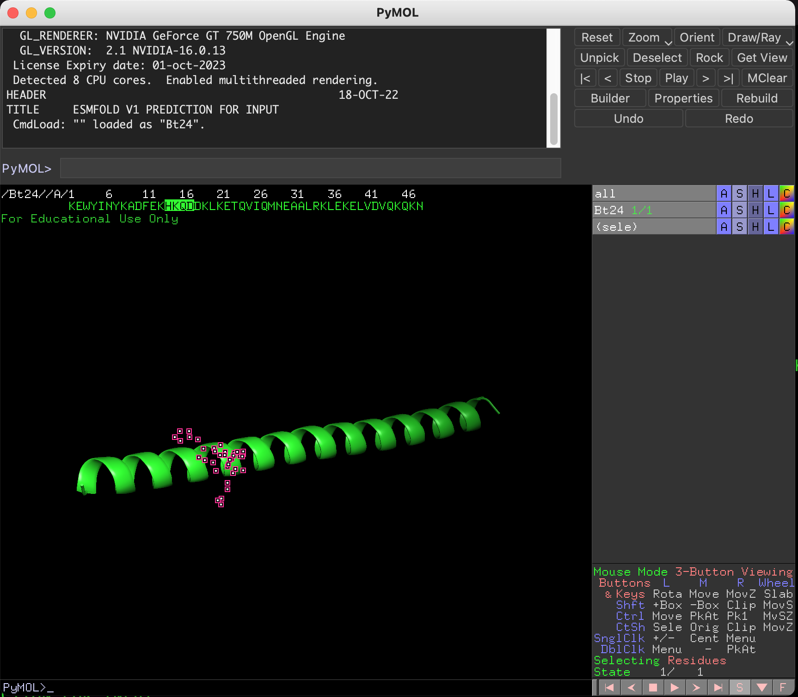

# ESMFold_local
<!-- What is this for? -->
**ESMFold** is a deep neural network-based method for predicting protein structure from amino acid sequence, which features up to 60x faster predictions compared to the current state-of-the-art structural prediction method. This is ideal for users when quickly deciding where to truncate the protein sequence (for the purpose of domain-wise analysis and speeding up the computation) if the predicted structure of interest is provided within seconds.

The `ESMFold_local` uses [ESMFold](https://colab.research.google.com/github/sokrypton/ColabFold/blob/main/ESMFold.ipynb) to quickly generate predicted structure without having to install ESMFold and download param files. The script will allow user to input protein sequence of interest to predict structure and make decision on truncating the protein sequence based on the predicted model. The script generates truncated fasta sequence to be used for `VirtualPullDown`. 

-----------------------------
## Usage
The script asks for amino acid sequence (limited to < 200) to be predicted and returns an ouput file in pdb. The predicted structure will be displayed in PyMol for the user to decide the region to truncate. Once PyMol closes, the user can input the unique protein sequence (at least 4 residues or longer) of the region to truncate. The user can also decide to truncate N-terminus or C-terminus of the specified region.

Here are the two ways you can run the script...
```
./ESMFold_local.py #The script will ask for the protein sequence 
or
./ESMFold_local.py KEWYINYKADFEKHKQDDKLKETQVIQMNEAALRKLEKELVDVQKQKN... # Provide the sequence to be predicted
```
Then, the script will utilize PyMol to visualize the predicted structure...
```
Opening pymol to visualize the predicted structure...
Please identify the protein sequence of the region you wish to truncate...
```


Once the protein sequence of the region to truncate is decided, then close PyMol and follow the prompts...
```
Please enter a protein sequence of the region (4-5 residues) you wish to truncate i.e. DEFQ:HKQD
Found pattern 'HKQD' in Bt24 at positions 14-17
Do you want to truncate N-terminal of the motif or C-terminal of the motif? (n or c): n
```
Truncating N-terminal from from the motif will generate bait_truncated.fasta 
```
>Bt24
HKQDDKLKETQVIQMNEAALRKLEKELVDVQKQKN
```
<details>
   <summary> :rocket: Click here for the python script </summary>
   
   ```Python
   #!/usr/bin/env python3
   # -*- coding: utf-8 -*-
   import os
   import sys
   import requests
   import subprocess
   from run import pdb_to_fasta
   from Bio import SeqIO
   import re
   #######################################
   path        ='./'
   bait_name   ='Bt24'
   #######################################
   pdb_file    =f"{bait_name}.pdb"
   output_name =bait_name
   
   url = "https://api.esmatlas.com/foldSequence/v1/pdb/"
   if len(sys.argv) > 1:
       protein_sequence = sys.argv[1]
   else:
       print("Error: Protein sequence not provided.")
       protein_sequence= input("Please enter a protein sequence: ")
       if not protein_sequence:
           print("Error: Protein sequence not provided.")
           sys.exit()

   # Find the path of pymol
   pymol_path = os.popen("which pymol").read().strip()

   if not pymol_path:
       print("Error: PyMOL is not installed.")
       sys.exit()

   # Define the request headers
   headers = {
       "Content-Type": "text/plain"
   }

   # Define the request body
   data = protein_sequence

   # Send the POST request to the API
   response = requests.post(url, headers=headers, data=data)

   # Check the status code of the response
   if response.status_code == 200:
       # Print the raw response text
       with open(f"{pdb_file}", "w") as f:
           f.write(response.text)
       pdb_to_fasta(path, pdb_file, output_name)
       subprocess.call("echo Opening pymol to visualize the predicted structure... \n", shell=True)
       subprocess.call("echo Please identify the protein sequence of the region you wish to truncate... \n", shell=True)
       os.system(f"{pymol_path} -p {pdb_file}")
   else:
       print(f"Error: {response.status_code}")
   seq_to_cut=input("Please enter a protein sequence of the region (4-5 residues) you wish to truncate i.e. DEFQ:")
   
   # Open the FASTA file
   fasta_file = f"{output_name}.fasta"
   for record in SeqIO.parse(fasta_file, "fasta"):
       # Search for a pattern using a regular expression
       pattern = seq_to_cut
       match = re.search(pattern, str(record.seq))
       if match:
           # Get the start and end positions of the match
           start_pos = match.start() + 1  # Add 1 to convert from 0-based to 1-based numbering
           end_pos = match.end()
           # Do something with the start and end positions
           print(f"Found pattern '{pattern}' in {record.id} at positions {start_pos}-{end_pos}") 
       else:
           print(f"Error: Pattern not found. Please check the sequence again...\n")
           exit(1)
   ques=input("Do you want to truncate N-terminal of the motif or C-terminal of the motif? (n or c): ")
   if ques.lower()=='n':
       with open (fasta_file) as f:
           data=f.readlines()
       for i in range (0, len(data), 2):
           seq_id=data[i].strip()
           seq = data[i+1].strip()
           pattern_pos=re.search(pattern, seq)
           if pattern_pos:
               truncated_seq=seq[pattern_pos.start():]
               sys.stdout=open(f"{output_name}_bait_truncated.fasta","w")
               print(seq_id)
               print(truncated_seq)
   elif ques.lower()=='c':
       with open (fasta_file) as f:
           data=f.readlines()
       for i in range (0, len(data), 2):
           seq_id=data[i].strip()
           seq = data[i+1].strip()
           pattern_pos=re.search(pattern, seq)
           if pattern_pos:
               truncated_seq=seq[:pattern_pos.start()]
               sys.stdout=open(f"{output_name}_bait_truncated.fasta","w")
               print(seq_id)
               print(truncated_seq)
   ```
</details>

