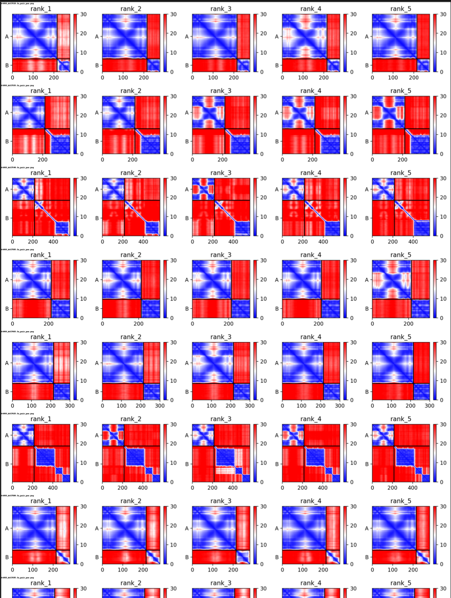
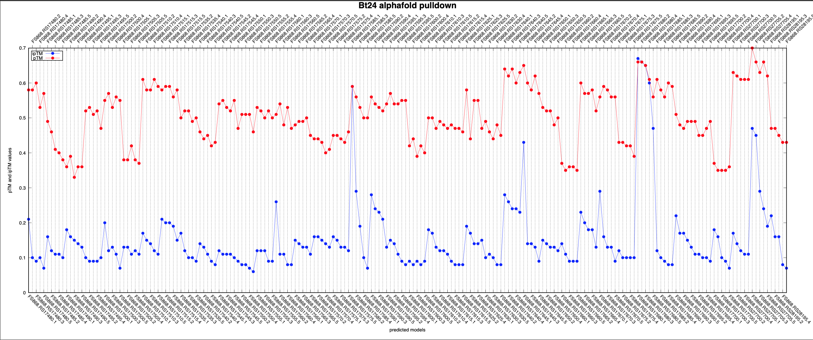

## Step 3. Postprocessing 
postprocessing scripts for ColabFold output files return figures to facilitate navigation and interpretation of virtual pulldown results.
## Dependencies
This package needs --['numpy'](https://numpy.org/), --['pillow'](https://pillow.readthedocs.io/en/stable/).

### :star: One step post-processing with `makefig_auto.py`
The code returns a concatenated figure of PAE and plots of pTM and ipTM.

Here are the two ways you can run the script...


pTM and ipTM plot and concatenated PAE figure will be saved in pdf files...


<details>
   <summary> :rocket: Click here for the python script </summary>
   
   ```Python
   #!/usr/bin/env python
   """
   Usage:        ./makefig_auto.py
   Author:       Heewhan Shin
   Author_email: hshin40@gmail.com
   Date:         April 28, 2023
   Description:  This script extracts pTM and ipTM values from output files and produces a scatter plot and concatenate all PAE plots.
   """
   from run import concatenate_images, plot_ptm_iptm, convert_to_pdf, rename_files
   import subprocess
   import os
   import argparse

   ## Specify inputs
   ###########################################################
   path            = "./"                  #Working directory
   bait_name       = 'Bt24'                #Name of integrase
   title_offset    = 2                     #Change number to adjust location of the title
   f_width         = 12                    #Figure width
   f_height        = 5                     #Figure height
   fontsize        = 10                    #Decrease the font and figure sizes or margins to fit a plot in a white space 
   margin_top      = 10                    
   margin_bot      = 10 
   margin_left     = 10
   margin_right    = 10
   key_position    = 'left'                # right, left, topleft, topright..etc
   ###########################################################

   parser = argparse.ArgumentParser(description='Generate pTM and ipTM plot and concatenated PAE figure')
   parser.add_argument('bait_name_given', metavar='bait_name_given', type=str, nargs='?', default=None, help='Name of integrase')
   args = parser.parse_args()

   if args.bait_name_given is not None:
       bait_name = args.bait_name_given
       print(f"Making figures using the name provided: {bait_name}")
   else:
       print("No arguments provided...")
       print("Using the following inputs found in the script...")
       print(f"Name of integrase: {bait_name}")
   
   rename_files(path)

figures=['%s.eps'%(bait_name),'%s_pae.png'%(bait_name)]

   if os.path.isfile("%s_pae.png"%(bait_name)):
       print("Concatenated %s_pae figure already exists.."%(bait_name))
       print("Stopping process. Please check the figure..")
       exit(1)

   ##making PAE plots
   result = concatenate_images(path)
   result.save('%s_pae.png'%(bait_name))

   subprocess.call("echo pae plots are concatenated...", shell=True)
   subprocess.call("echo plotting pTM and iPTM values...\n", shell=True)

   ##plotting ptm and iptm data
   plot_ptm_iptm(bait_name, title_offset, path, f_width, f_height, fontsize, margin_top, margin_bot, margin_left, margin_right, key_position)
   subprocess.call("echo pTM, iPTM values are plotted...\n", shell=True)
   subprocess.call("echo converting eps to pdf...",shell=True)

   ##converting figures to pdf
   convert_to_pdf(figures)
   ```
</details>

--------------------------------------

### :asterisk: Examples for each function (https://github.com/heeropang/VirtualPullDown/tree/main/postprocessing/figures)
Running the script will produce concatenated PAE plot below, which allow a quick comparison of PAE plots



<details>
   <summary> :rocket: Click here for the python script </summary>

   ### Renaming output files to locus_tag
   a python script to rename output files from ColabFold
   ```Python
   #!/usr/bin/env python3
   # -*- coding: utf-8 -*-
   import os

   new_names=[]

   # Directory containing the files
   path = "./"

   # Get a list of files in the directory
   files = os.listdir(path)
   ##
   # Filter the files to get only the ones with .a3m extension
   a3m_files = sorted([f for f in files if f.endswith(".a3m")])
   a3m_files = sorted(a3m_files, key=lambda x: int(x.split(".")[0]))
   for a3m_file in a3m_files:
       with open(a3m_file, "r") as f:
           lines=f.readlines()
           second_line =lines[1]
           new_names.append(second_line.split( )[1])
   
   # Iterate over the a3m files and rename the corresponding files with the new names
   name_dict = {}
   for a3m_file, new_file in zip(a3m_files, new_names):
       keyword = a3m_file.split(".")[0] + '_'
       name_dict[keyword] = new_file
   for file in files:
       # check if file starts with any of the keys in name_dict
       for key in name_dict.keys():
           if file.startswith(key):
               new_filename = file.replace(key, name_dict[key]+'_',1)
               #rename
               os.rename(os.path.join(path, file), os.path.join(path, new_filename))
               break
   ```
   ### Concetanate PAE plots
   
   The following code snippet concatenate all PAE plots in the project directory and returns one figure.  
   
   ```Python
   #!/usr/bin/env python3
   # -*- coding: utf-8 -*-

   import glob
   from PIL import Image, ImageDraw, ImageFont
   import os

   def concatenate_images(folder_path, title_font_size=16):
       # Get all PNG files in the directory
       image_files = glob.glob(f'{folder_path}/*.png')
   
       # Open all images
       images = [Image.open(img) for img in image_files]
   
       # Get dimensions of the first image
       width, height = images[0].size
   
       # Create a new image with the same width and the combined height of all images
       result = Image.new('RGB', (width, height * len(images)), color='white')
   
       # Paste each image into the result image vertically
       for i, img in enumerate(images):
           result.paste(img, (0, i * height))
   
       # Add a title to each image
       title_font = ImageFont.load_default()
       draw = ImageDraw.Draw(result)
       title_font_size = 24
       for i, img_file in enumerate(image_files):
           label = os.path.basename(img_file)
           label_width, label_height = draw.textsize(label, font=title_font)
           draw.text((0, i * height), label, font=title_font, fill=(0, 0, 0))
   
       return result
   
   folder_path = './'
   result = concatenate_images(folder_path)
   result.save('result.png')
   ```
</details>

And a pTM ipTM plot, which concurrently allows users to quickly navigate and interpret the results. 



<details>
   <summary> :rocket: Click here for the python script </summary>
   ### Plot pTM and ipTM values

   The method `plot_ptm_iptm` fetches pTM and ipTM values from json files of ColabFold output and use gnuplot to plot the values.

   ```Python
   #!/usr/bin/env python3
   # -*- coding: utf-8 -*-
   import json
   import subprocess
   import numpy as np
   import glob

   #This script will extract pTM, ipTM from *_seed_000.json files and plot them to compare between files
   ########################################
   bait_name    ='Se37'
   title_offset = 2
   folder_path  ='.'
   f_width      = 12 #figure width
   f_height     = 5  #figure height
   fontsize     = 10
   margin_top   = 10
   margin_bot   = 10
   margin_left  = 10
   margin_right = 11
   key_position = 'left'
   ########################################
   ptms=[]
   iptms=[]
   pae_data=[]
   gnu_data=[]
   json_files = glob.glob(f'{folder_path}/*_seed_000.json')
   for json_file in sorted(json_files):
       with open (json_file) as f:
           data=json.load(f)
           ptms.append(data['ptm'])
           iptms.append(data['iptm'])

   for i, p, ip in zip(sorted(json_files), ptms, iptms):
       pae_data.append(\
   f"{i.split('.fa_pair_scores_rank')[0][2:]+'_'+i.split('.fa_pair_scores_rank_00')[1][:1]} {p:.2f} {ip:.2f}")
   
   for data in pae_data:
       gnu_data.append(data.replace('_','.'))

   # Plot the graph using gnuplot
   with open('%s.gp'%(bait_name), 'w') as f:
       # Define the plot settings
       f.write('set term x11\n')
       f.write('set tmargin %d\n'%(margin_top))
       f.write('set bmargin %d\n'%(margin_bot))
       f.write('set lmargin %d\n'%(margin_left))
       f.write('set rmargin %d\n'%(margin_right))
       f.write('set title "%s alphafold pulldown" font "Helvetica-Bold, 18" offset 0,%d \n'%(bait_name,title_offset))
       f.write('set xlabel "predicted models"\n')
       f.write('set ylabel "pTM and ipTM values"\n')
       f.write('set key %s\n'%(key_position))
       f.write('set xtics rotate by -45\n')
       f.write('set key box lt -1 lw 2\n')
       f.write('set x2tics out\n')
       f.write('set x2tics rotate by 45\n')
       f.write('set grid xtics\n')
       f.write('set grid x2tics\n')
       f.write('set terminal postscript eps enhanced color solid "Helvetica" %d size %d,%d\n'%(fontsize, f_width, f_height))
       f.write('set output "%s.eps"\n'%(bait_name))
       # Plot the data
       f.write('plot "-" u 1:3:4:xticlabels(2) w p pt 7 lc rgb "red" notitle, "-" u 1:3:4:x2ticlabel(2) w p pt 7 lc rgb "red" notitle, "-" u 1:4 w lp pt 7 lc rgb "blue" t "ipTM", "-" u 1:3 w lp pt 7 lc rgb "red" t "pTM" \n')
    
       for i in range(0,len(gnu_data),2):
           f.write('{} {}\n'.format(i+1,gnu_data[i]))
       f.write('e\n')
       for i in range(1,len(gnu_data),2): 
           f.write('{} {}\n'.format(i+1,gnu_data[i]))
       f.write('e\n')
       for i in range(len(gnu_data)):
           f.write('{} {}\n'.format(i+1,gnu_data[i]))
       f.write('e\n')
       for i in range(len(gnu_data)):
           f.write('{} {}\n'.format(i+1,gnu_data[i]))
       f.write('e\n')
   # Call gnuplot to create the graph
   subprocess.call(['gnuplot', '%s.gp'%(bait_name)])
   ```
</details>


