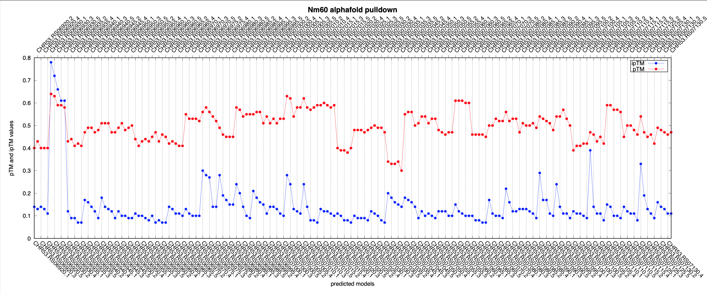

<!-- What is this for? -->

## Get started with `postprocessing`
postprocessing scripts for Alphafold output files return a scatter plot and figure to help users navigate the result quickly.

<!-- Minimal dependency -->

## Dependencies
### Rename output files
a python script to rename output files from Alphafold
```Python
#!/usr/bin/env python3
# -*- coding: utf-8 -*-
import os

new_names=[
    "FS868_RS17480.fa_pair",
    "FS868_RS17485.fa_pair",
    "FS868_RS17490.fa_pair",
    "FS868_RS17495.fa_pair",
    "FS868_RS17500.fa_pair",
    "FS868_RS17505.fa_pair",
  ##rest of the files
]

# Directory containing the files
directory = "./"

# Get a list of files in the directory
files = os.listdir(directory)

# Filter the files to get only the ones with .a3m extension
a3m_files = sorted([f for f in files if f.endswith(".a3m")])
a3m_files = sorted(a3m_files, key=lambda x: int(x.split(".")[0]))

# Iterate over the a3m files and rename the corresponding files with the new names
name_dict = {}
for a3m_file, new_file in zip(a3m_files, new_names):
    keyword = a3m_file.split(".")[0] + '_'
    name_dict[keyword] = new_file
for file in files:
    # check if file starts with any of the keys in name_dict
    for key in name_dict.keys():
        if file.startswith(key):
            new_filename = file.replace(key, name_dict[key]+'_',1)
            #rename
            os.rename(os.path.join(directory, file), os.path.join(directory, new_filename))
            break
```

This package needs --['numpy'](https://numpy.org/), --['pillow'](https://pillow.readthedocs.io/en/stable/).
### Concetanate PAE plots

The following code snippet concatenate all PAE plots in the project directory and returns one figure.  

```Python
#!/usr/bin/env python3
# -*- coding: utf-8 -*-

import glob
from PIL import Image, ImageDraw, ImageFont
import os

def concatenate_images(folder_path, title_font_size=16):
    # Get all PNG files in the directory
    image_files = glob.glob(f'{folder_path}/*.png')

    # Open all images
    images = [Image.open(img) for img in image_files]

    # Get dimensions of the first image
    width, height = images[0].size

    # Create a new image with the same width and the combined height of all images
    result = Image.new('RGB', (width, height * len(images)), color='white')

    # Paste each image into the result image vertically
    for i, img in enumerate(images):
        result.paste(img, (0, i * height))

    # Add a title to each image
    title_font = ImageFont.load_default()
    draw = ImageDraw.Draw(result)
    title_font_size = 24
    for i, img_file in enumerate(image_files):
        label = os.path.basename(img_file)
        label_width, label_height = draw.textsize(label, font=title_font)
        draw.text((0, i * height), label, font=title_font, fill=(0, 0, 0))

    return result

folder_path = './'
result = concatenate_images(folder_path)
result.save('result.png')
```
Concatenated PAEs allow a quick comparison of PAE plots


### Plot pTM and ipTM values

The method `plot_ptm_iptm` fetches pTM and ipTM values from json files of Alphafold output and use gnuplot to plot the values.

```Python
#!/usr/bin/env python3
# -*- coding: utf-8 -*-
import json
import subprocess
import numpy as np
import glob

#this script will extract pTM, ipTM from *_seed_000.json files and plot them to compare between files
########################################
bait_name    ='Se37'
title_offset = 2
folder_path  ='.'
f_width      = 12 #figure width
f_height     = 5  #figure height
fontsize     = 10
margin_top   = 10
margin_bot   = 10
margin_left  = 10
margin_right = 11
key_position = 'left'
########################################
ptms=[]
iptms=[]
pae_data=[]
gnu_data=[]
json_files = glob.glob(f'{folder_path}/*_seed_000.json')
for json_file in sorted(json_files):
    with open (json_file) as f:
        data=json.load(f)
        ptms.append(data['ptm'])
        iptms.append(data['iptm'])

for i, p, ip in zip(sorted(json_files), ptms, iptms):
    pae_data.append(\
f"{i.split('.fa_pair_scores_rank')[0][2:]+'_'+i.split('.fa_pair_scores_rank_00')[1][:1]} {p:.2f} {ip:.2f}")

for data in pae_data:
    gnu_data.append(data.replace('_','.'))


# Plot the graph using gnuplot
with open('%s.gp'%(bait_name), 'w') as f:
    # Define the plot settings
    f.write('set term x11"\n')
    f.write('set tmargin %d\n'%(margin_top))
    f.write('set bmargin %d\n'%(margin_bot))
    f.write('set lmargin %d\n'%(margin_left))
    f.write('set rmargin %d\n'%(margin_right))
    f.write('set title "%s alphafold pulldown" font "Helvetica-Bold, 18" offset 0,%d \n'%(bait_name,title_offset))
    f.write('set xlabel "predicted models"\n')
    f.write('set ylabel "pTM and ipTM values"\n')
    f.write('set key %s\n'%(key_position))
    f.write('set xtics rotate by -45\n')
    f.write('set key box lt -1 lw 2\n')
    f.write('set x2tics out\n')
    f.write('set x2tics rotate by 45\n')
    f.write('set grid xtics\n')
    f.write('set grid x2tics\n')
    f.write('set terminal postscript eps enhanced color solid "Helvetica" %d size %d,%d\n'%(fontsize, f_width, f_height))
    f.write('set output "%s.eps"\n'%(bait_name))
    # Plot the data
    f.write('plot "-" u 1:3:4:xticlabels(2) w p pt 7 lc rgb "red" notitle, "-" u 1:3:4:x2ticlabel(2) w p pt 7 lc rgb "red" notitle, "-" u 1:4 w lp pt 7 lc rgb "blue" t "ipTM", "-" u 1:3 w lp pt 7 lc rgb "red" t "pTM" \n')
    
    for i in range(0,len(gnu_data),2):
        f.write('{} {}\n'.format(i+1,gnu_data[i]))
    f.write('e\n')
    for i in range(1,len(gnu_data),2): 
        f.write('{} {}\n'.format(i+1,gnu_data[i]))
    f.write('e\n')
    for i in range(len(gnu_data)):
        f.write('{} {}\n'.format(i+1,gnu_data[i]))
    f.write('e\n')
    for i in range(len(gnu_data)):
        f.write('{} {}\n'.format(i+1,gnu_data[i]))
    f.write('e\n')
# Call gnuplot to create the graph
subprocess.call(['gnuplot', '%s.gp'%(bait_name)])
```
A scatter plot of pTM and ipTM values allows users to quickly identify the predicted complex model in the screening assay. 



