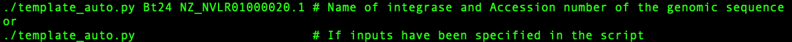
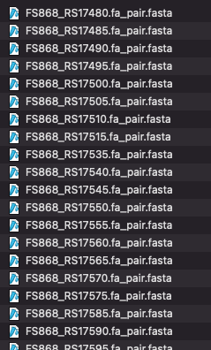

## Step 1. Preprocessing
In this step, the sequence files are processed to be used as input files for ColabFold. The script utilizes the genomic protein sequence (i.e., sequence.txt) downloaded from NCBI and the protein sequence of interest (i.e., integrase.fasta).

The template_auto.py script first searches for prophages using Phaster.ca and fetches those regions (if found) upon user consent. Otherwise, the script prompts the user to specify the region of interest in the genomic sequence.

Next, the script individually pairs the fetched protein sequences within the specified region (as prey sequences) with the sequence of interest (as a bait sequence).

## Dependencies

This package needs --['BIO'](https://biopython.org),--['openpyxl'](https://foss.heptapod.net/openpyxl/openpyxl), and --['run'](https://github.com/heeropang/VirtualPullDown/tree/main/preprocessing/run).  

### :star: One step preprocessing with `template_auto.py`
`template_auto.py` combines searching prophage region, organizing proteoms, fetching protein sequences, preparing paired input files for ColabFold

Here are the two ways you can run the script...


<details>
   <summary> :rocket: Click here for the python script </summary>
   
   ```Python
   #!/usr/bin/env python
   """
   Usage:        ./template_auto.py
   Author:       Heewhan Shin
   Author_email: hshin40@gmail.com
   Date:         April 25, 2023
   Description:  This script identifies prophages (if any) then produces paired input sequence files for multimer predictions using localcolabfold.
   """ 
   from run import create_mastertable, identify_prophage_region, filter_prey_sequences, combine_pairwise_batch
   import subprocess
   import glob
   import os
   import sys
   import argparse
 
   ## Specify inputs
   ###########################################################
   path            = "./"                  #Working directory
   filename        = 'sequence'            #Genomic sequence
   prey_size_limit = 400                   #Residue size
   bait_name       = 'Bt24'                #Name of integrase
   accession_number= 'NZ_NVLR01000020.1'
   ###########################################################

   parser = argparse.ArgumentParser(description='Identify prophages and prepare input sequence files for multimer predictions using localcolabfold')
   parser.add_argument('bait_name_given', metavar='bait_name_given', type=str, nargs='?', default=None, help='Name of integrase')
   parser.add_argument('accession_number_given', metavar='accession_number_given', type=str, nargs='?', default=None, help='Accession number of the genomic sequence')
   args = parser.parse_args()

   if args.bait_name_given and args.accession_number_given:
       bait_name = args.bait_name_given
       accession_number = args.accession_number_given
       print(f"Name of integrase: {args.bait_name_given}")
       print(f"Accession number of the genomic sequence: {args.accession_number_given}")
   else:
       bait_name = bait_name
       accession_number = accession_number
       print("No arguments provided...")
       print("Using the following inputs found in the script...")
       print(f"Name of integrase: {bait_name}")
       print(f"Accession number of the genomic sequence: {accession_number}")
 
   ## Checking prerequisite files
   if not os.path.isfile("%s.txt"%(filename)):
       print("Error: please check if the genomic sequence is saved in the directory")
       exit(1)
   if not os.path.isfile("%s.fasta"%(bait_name)):
       print("Error: %s.fasta does not exist\n"%(bait_name))
       exit(1)
   if not os.path.isfile("%s_bait_truncated.fasta"%(bait_name)):
       print("Error: %s_bait_truncated.fasta does not exist\n"%(bait_name))
       exit(1)
 
   ## Fixing the genomic sequence formatting issue if it exists
   sed_cmd = "sed -e 's/\[db_xref=[^]]*\] //g' sequence.txt >sequence_check.txt"
   subprocess.call(sed_cmd, shell=True)
      
   ## Preparing subdirectories
   subprocess.call("mkdir fa ready", shell=True)
   subprocess.call("rm fa/*", stdout=subprocess.DEVNULL, stderr=subprocess.DEVNULL, shell=True)
   subprocess.call("rm ready/*", stdout=subprocess.DEVNULL, stderr=subprocess.DEVNULL, shell=True)
   range           = 'range.txt'
   filenames       = sorted(glob.glob("./fa/"+"*.fa"))
   
   ## create mastertable
   create_mastertable(path, filename, prey_size_limit, bait_name)
   subprocess.call("echo Searching for prophage using Phaster..\n", shell=True)
   
   ## Search prophage
   identify_prophage_region(accession_number)
   
   if os.path.isfile(range):
       user_input = input("Regions of prophages identified. Do you want to use the identified range? (y/n): ")
       if user_input.lower() == "y":
           with open(range, 'r') as f:
               filter_start, filter_end= f.readline().strip().split()
               filter_start    = int(filter_start)
               filter_end      = int(filter_end)
               print("Using the identified range from Phaster: %d to %d"%(filter_start, filter_end))
       elif user_input.lower()=="n":
           print("Proceed with manual input of the range.")
           filter_start = int(input("Enter the range start: "))
           filter_end   = int(input("Enter the range end: "))
       else:
           print("Invalid input. Please enter 'y or 'no'.")
           exit(1)
   else:
       print("Prophages not identified. Proceed with manual input of the range.")
       filter_start = int(input("Enter the range start: "))
       filter_end   = int(input("Enter the range end: "))
      
   # Filter prey sequences
   filter_prey_sequences(path, filename, prey_size_limit, bait_name, filter_start, filter_end)
   subprocess.call("mv ./*.fa fa/", shell=True)
      
   combine_pairwise_batch(path, filenames, bait_name)
   subprocess.call("mv fa/*.fasta ready/", shell=True)
   subprocess.call("echo Preprocessing is complete..\n", shell=True)
   subprocess.call("echo Input files saved in ready folder..\n", shell=True)
   ```
</details>

------------------

If the prophage is not found, then the script will ask the user for manual inputs to specify the range of interest...


If the prophage is found via Phaster, then the script will ask the user to proceed with or without manual inputs...


Applying the prophage range found via Phaster...


Output files will be stored in the ready folder...



--------------------------------------------
### :asterisk: Examples for each function
<details>
   <summary> :rocket: Click here for the python script </summary>
   
   ### Search for prophage

   The following code snippet search for prophage using --['phaster'](https://phaster.ca/)'s URLAPI with genomic sequence's accession code.  

   ```Python
   from run import identify_prophage_region
   import re
   import subprocess
   import sys
   from Bio import SeqIO
   from os.path import join
   from openpyxl import Workbook
   path            = "./"                  #Working directory
   filename        = 'sequence'            #Genomic sequence
   prey_size_limit = 400                   #Residue size
   bait_name       = 'Sa34'                #Name of integrase
   accession_number= 'NZ_FJQW01000022.1'
   identify_prophage_region(accession_number)
   ```
   ### Create a master table to naviagate gene information

   The method create_mastertable returns a master table in the form of an Excel file (mastertable.xlsx) containing locus_tag, gene description, gene size, and location information. The following code snippet shows how to generate the master table using create_mastertable.

   ```Python
   # Create a master table ...
   from run import create_mastertable 
   path            = "./"                  #Working directory
   filename        = 'sequence'            #Genomic sequence
   prey_size_limit = 400                   #Residue size
   bait_name       = 'Sa34'                #Name of integrase
   create_mastertable(path, filename, prey_size_limit, bait_name)
   ```

   A master table keeps gene information.

   

   ### Apply the range of interest 
   The method `filter_prey_sequences` applies identified prophage or user-specified range and returns a filtered.xlsx table, gene sequences.
   The following example show how to achieve it using filter_prey_sequences

   ```Python
   # Fetch sequences to screen
   from run import filter_prey_sequences
   path            = "./"                  #Working directory
   filename        = 'sequence'            #Genomic sequence
   prey_size_limit = 400                   #Residue size
   bait_name       = 'Sa34'                #Name of integrase
   filter_start    = 36108        
   filter_end      = 57723   
   filter_prey_sequences(path, filename, prey_size_limit, bait_name, filter_start, filter_end)
   ```
   A filtered table keeps track of which sequences are fetched and skipped.
   

   ### Pair sequences to be screened to the sequence of interest
   The method `combine_pairwise_batch` returns paired sequences in fasta format (seq1:seq2, seq1:seq3,...,seq1:seqn) to to be used as input files for ColabFold.
   The following example show how to achieve it using combine_pairwise_batch

   ```Python
   # Pairing sequences
   from run import combine_pairwise_batch
   path            = "./"                  #Working directory
   filenames       = sorted(glob.glob("./fa/"+"*.fa"))
   bait_name       = 'Sa34'                #Name of integrase
   combine_pairwise_batch(path, filenames, bait_name)
   ```
</details>

-----------------------------------------------------------------------------------
