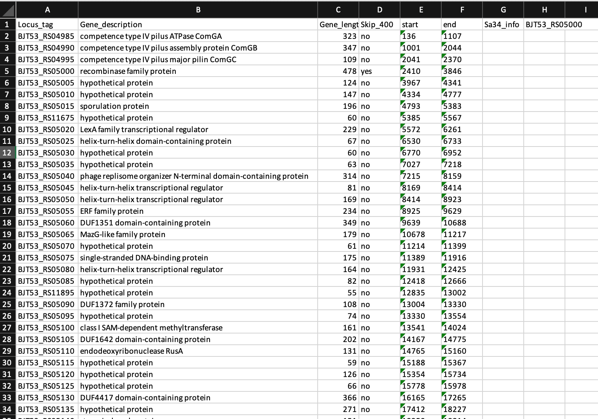
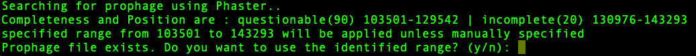
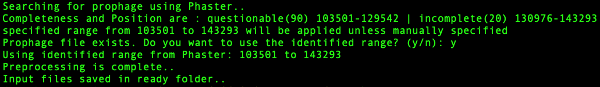

<!-- What is this for? -->

## Get started with `run`
This package is for preprocessing sequence input files for Alphafold. Genomic sequence retrieved from NCBI will be used to search for prophages and fetch those prophage sequences or user specified regions in the genomic sequence. Then, these sequences are paired with the sequence of interest to be screened for binding partner(s) via Alphafold.

<!-- Why it might be a good choice? -->

<!-- Minimal dependency -->

## Dependencies

This package needs --['BIO'](https://biopython.org),--['openpyxl'](https://foss.heptapod.net/openpyxl/openpyxl).  

### Import the library

```Python
import run
```

### Search for prophage

The following code snippet search for prophage using --['phaster'](https://phaster.ca/)'s URLAPI with genomic sequence's accession code.  

```Python
from run import identify_prophage_region
import re
import subprocess
import sys
from Bio import SeqIO
from os.path import join
from openpyxl import Workbook
path            = "./"                  #Working directory
filename        = 'sequence'            #Genomic sequence
prey_size_limit = 400                   #Residue size
bait_name       = 'Sa34'                #Name of integrase
accession_number= 'NZ_FJQW01000022.1'
identify_prophage_region(accession_number)
```

### Create a master table to naviagate gene information

The method `create_mastertable` returns a mastertable.xlsx with locus_tag, gene description, gene size, and location information.
The following example shows how to achieve it using create_mastertable.

```Python
# Create a master table ...
from run import create_mastertable 
path            = "./"                  #Working directory
filename        = 'sequence'            #Genomic sequence
prey_size_limit = 400                   #Residue size
bait_name       = 'Sa34'                #Name of integrase
create_mastertable(path, filename, prey_size_limit, bait_name)
```

A master table keeps gene information.



### Apply the range of interest 
The method `filter_prey_sequences` applies identified prophage or user-specified range and returns a filtered.xlsx table, gene sequences.
The following example show how to achieve it using filter_prey_sequences

```Python
# Fetch sequences to screen
from run import filter_prey_sequences
path            = "./"                  #Working directory
filename        = 'sequence'            #Genomic sequence
prey_size_limit = 400                   #Residue size
bait_name       = 'Sa34'                #Name of integrase
filter_start    = 36108        
filter_end      = 57723   
filter_prey_sequences(path, filename, prey_size_limit, bait_name, filter_start, filter_end)
```
A filtered table keeps track of which sequences are fetched and skipped.


### Pair sequences to be screened to the sequence of interest
The method `combine_pairwise_batch` returns paired sequences in fasta format (seq1:seq2, seq1:seq3,...,seq1:seqn) to to be used as input files for Alphafold.
The following example show how to achieve it using combine_pairwise_batch

```Python
# Pairing sequences
from run import combine_pairwise_batch
path            = "./"                  #Working directory
filenames       = sorted(glob.glob("./fa/"+"*.fa"))
bait_name       = 'Sa34'                #Name of integrase
combine_pairwise_batch(path, filenames, bait_name)
```
Any of the methods listed above can be utilized separately in other scripts.

### One step preprocessing using template_auto.py
The following example show how to acheive all the preprocessing steps with template_auto
```Python
#!/usr/bin/env python

from run import create_mastertable, identify_prophage_region, filter_prey_sequences, combine_pairwise_batch
import subprocess
import glob
import os
import sys

## Specify inputs
###########################################################
path            = "./"                  #Working directory
filename        = 'sequence'            #Genomic sequence
prey_size_limit = 400                   #Residue size
bait_name       = 'Sa34'                #Name of integrase
accession_number= 'NZ_FJQW01000022.1'
###########################################################

## Checking prerequisite files
if not os.path.isfile("%s.txt"%(filename)):
    print("Error: please check if the genomic sequence is saved in the directory")
    exit(1)
if not os.path.isfile("%s.fasta"%(bait_name)):
    print("Error: %s.fasta does not exist\n"%(bait_name))
    exit(1)
if not os.path.isfile("%s_bait_truncated.fasta"%(bait_name)):
    print("Error: %s_bait_truncated.fasta does not exist\n"%(bait_name))
    exit(1)

## Fixing the genomic sequence formatting issue if it exists
sed_cmd = "sed -e 's/\[db_xref=[^]]*\] //g' sequence.txt >sequence_check.txt"
subprocess.call(sed_cmd, shell=True)

## Preparing subdirectories
subprocess.call("mkdir fa ready", shell=True)
subprocess.call("rm fa/*", stdout=subprocess.DEVNULL, stderr=subprocess.DEVNULL, shell=True)
subprocess.call("rm ready/*", stdout=subprocess.DEVNULL, stderr=subprocess.DEVNULL, shell=True)
range           = 'range.txt'
filenames       = sorted(glob.glob("./fa/"+"*.fa"))

## create mastertable
create_mastertable(path, filename, prey_size_limit, bait_name)
subprocess.call("echo Searching for prophage using Phaster..\n", shell=True)

## Search prophage
identify_prophage_region(accession_number)

if os.path.isfile(range):
    user_input = input("Prophage file exists. Do you want to use the identified range? (y/n): ")
    if user_input.lower() == "y":
        with open(range, 'r') as f:
            filter_start, filter_end= f.readline().strip().split()
            filter_start    = int(filter_start)
            filter_end      = int(filter_end)
            print("Using identified range from Phaster: %d to %d"%(filter_start, filter_end))
    elif user_input.lower()=="n":
        print("Proceed with manual input of the range.")
        filter_start = int(input("Enter the range start: "))
        filter_end   = int(input("Enter the range end: "))
    else:
        print("Invalid input. Please enter 'y or 'no'.")
        exit(1)
else:
    print("Prophage file does not exist. Proceed with manual input of the range.")
    filter_start = int(input("Enter the range start: "))
    filter_end   = int(input("Enter the range end: "))

# Filter prey sequences
filter_prey_sequences(path, filename, prey_size_limit, bait_name, filter_start, filter_end)
subprocess.call("mv ./*.fa fa/", shell=True)

combine_pairwise_batch(path, filenames, bait_name)
subprocess.call("mv fa/*.fasta ready/", shell=True)
subprocess.call("echo Preprocessing is complete..\n", shell=True)
subprocess.call("echo Input files saved in ready folder..\n", shell=True)
```
if the prophage is not found, then the script will ask the user for manual inputs to specify the range of interest.


if the prophage is found via Phaster, then the script will ask the user to proceed with or without manual inputs.


Applying the prophage range found via Phaster

